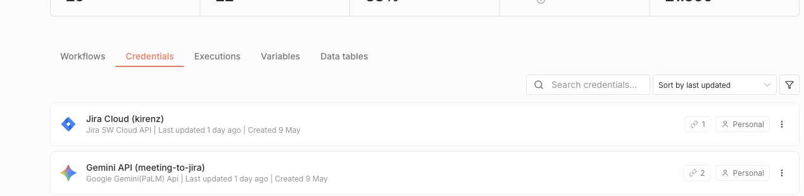

# Credentials vorbereiten

Bevor ein Workflow echte Mails lesen oder versenden kann, brauchen wir Zugangsdaten. n8n speichert diese Zugangsdaten als **Credentials**: getrennt vom Workflow, wiederverwendbar für mehrere Knoten und mit einem eigenen Zugriffsschutz. 

Credentials sind die Voraussetzung dafür, dass ein Workflow nicht nur im Editor simuliert, sondern in echten Systemen laufen kann.

## Warum Credentials benötigt werden

Ein n8n-Knoten kann nur dann mit einem externen Dienst sprechen, wenn er sich dort ausweisen kann. Beim Demo-Workflow betrifft das zwei Richtungen:

| Zugriff | Wofür wir ihn brauchen | Typischer Knoten |
|---|---|---|
| Mail lesen | Eingehende Nachricht als Trigger erkennen | Email Trigger (IMAP) |
| Mail senden | Automatische Bestätigung verschicken | Send Email (SMTP) |
| Optionale Tools | Slack, HubSpot, Notion oder Google Sheets ansprechen | jeweiliger App-Knoten |

Für den ersten Durchlauf nutzen wir zunächst einen manuellen Trigger und eine simulierte Mail. So lernen wir den Editor ohne Konto-Hürden kennen. Sobald das Prinzip klar ist, ersetzen wir die Simulation durch echte Mail-Credentials.

::: {.callout-tip title="Erst simulieren, dann verbinden"}
Mit einem kontrollierten Beispieldatensatz zu starten macht den Datenfluss sofort sichtbar. Erst danach verbinden wir echte Konten, bei denen Authentifizierung, Postfachregeln oder Spamfilter zusätzliche Fehlerquellen sein können.
:::

{#fig-credentials-uebersicht}

## Drei Credential-Arten im Kurs

**App-spezifisches Passwort.**
Einige Mail-Anbieter erlauben ein separates Passwort nur für Programme wie n8n. Dieses Passwort kann später widerrufen werden, ohne das Hauptpasswort des Mail-Kontos zu ändern. Für Internet Message Access Protocol (IMAP) und Simple Mail Transfer Protocol (SMTP) ist das eine verbreitete Einstiegsvariante.

**OAuth.**  
Bei Gmail, Microsoft 365 und vielen SaaS-Diensten ist OAuth die bessere Lösung. Wir melden uns beim Anbieter an, n8n erhält einen Token, und dieser Token kann begrenzt oder widerrufen werden. OAuth ist sicherer, kann aber in Self-Hosted-Instanzen etwas mehr Konfiguration verlangen.

**API-Token.**  
Slack, HubSpot, Notion oder interne Systeme arbeiten oft mit API-Tokens. Hier achten wir besonders auf den Scope: Ein Token, der nur Nachrichten in einen Slack-Channel schreiben darf, ist sicherer als ein Token mit Vollzugriff.

## Sichere Praxis

Wir halten uns an drei Regeln:

1. **Kein Hauptpasswort im Workflow.** Wir verwenden App-Passwörter, OAuth oder API-Tokens.
2. **Geringstmögliche Berechtigungen (Least Privilege).** Ein Credential bekommt nur die Berechtigungen, die der konkrete Workflow braucht.
3. **Trennung von Test und Produktion.** Testkonten und Testtabellen verhindern, dass ein Lernworkflow versehentlich echte Kundendaten verändert.

::: {.callout-important title="Credentials sind echte Schlüssel"}
Eine kompromittierte n8n-Instanz ist nicht nur ein Workflow-Problem. Sie kann Zugriff auf Mail-Konten, CRM-Systeme, Datenbanken und weitere API-Systeme öffnen. Deshalb behandeln wir Credentials wie echte Schlüssel: begrenzen, dokumentieren, regelmäßig prüfen und bei Verdacht widerrufen.
:::

## Mini-Checkliste vor dem Weiterbauen

Für Modul 02 reicht diese Vorbereitung:

- [ ] Eine n8n-Instanz ist erreichbar, Cloud oder Self-Hosted.
- [ ] Wir können einen Workflow im Editor öffnen und speichern.
- [ ] Für den Live-Modus legen wir später ein SMTP-Credential zum Senden und ein IMAP- oder Gmail-/Microsoft-Credential zum Lesen an.
- [ ] Die erste Testadresse sollte keine produktive Support- oder Sales-Adresse sein.

Damit ist die Grundlage gelegt. Im nächsten Kapitel importieren oder bauen wir den ersten Workflow und arbeiten zunächst mit simulierten Maildaten. Danach sehen wir genau, an welcher Stelle echte Credentials eingehängt werden.
