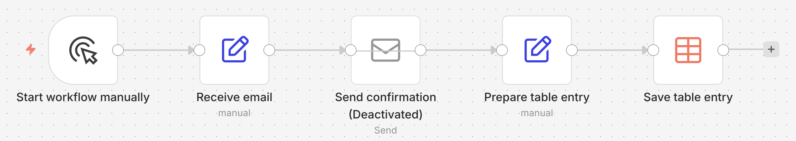
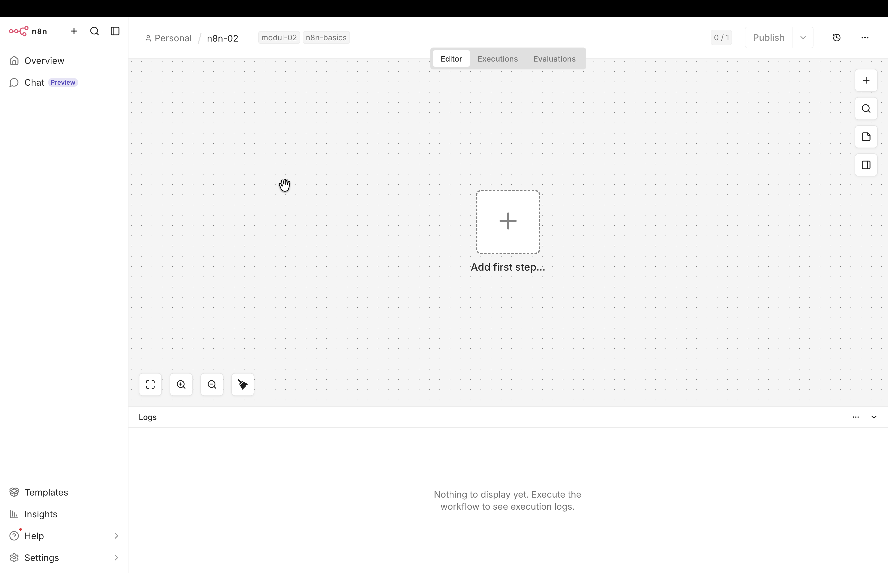
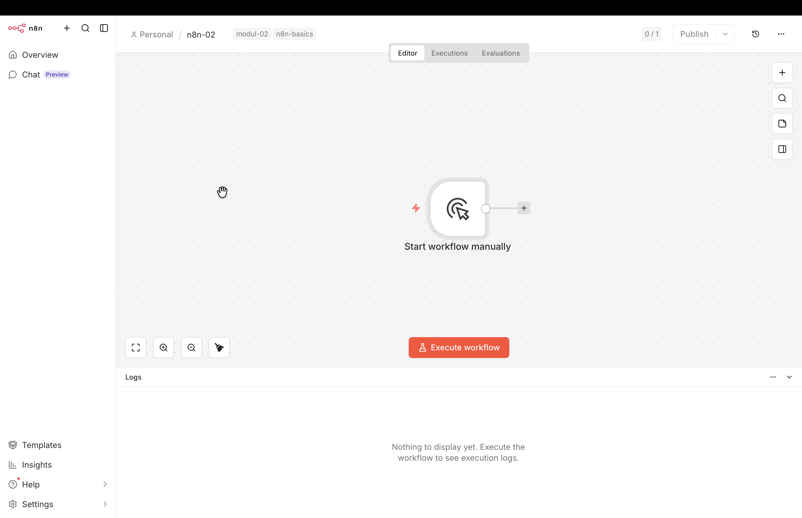
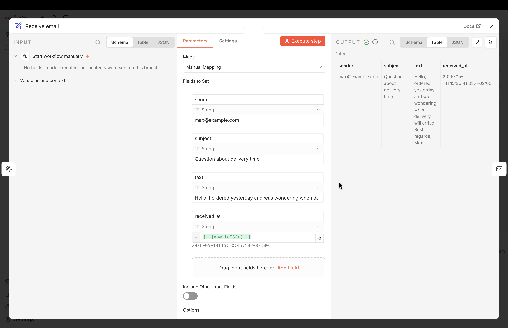
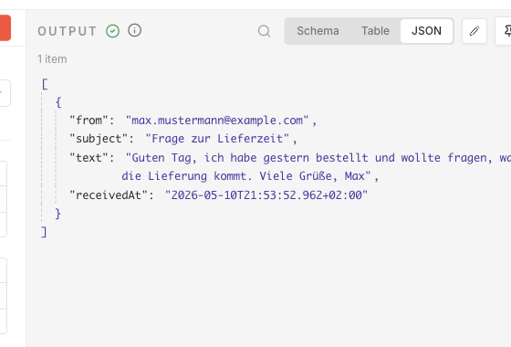
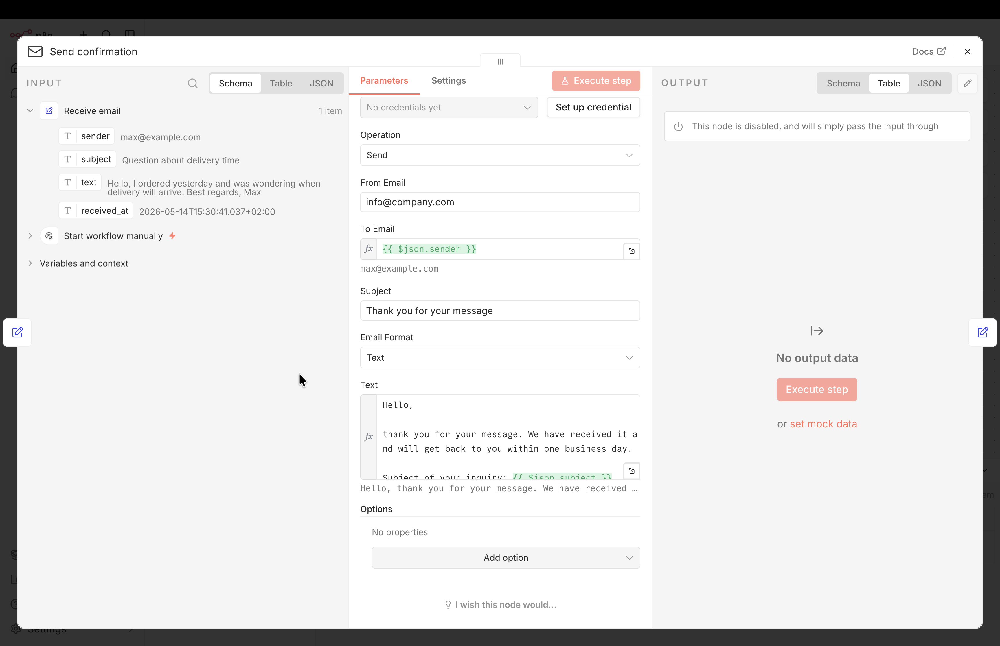
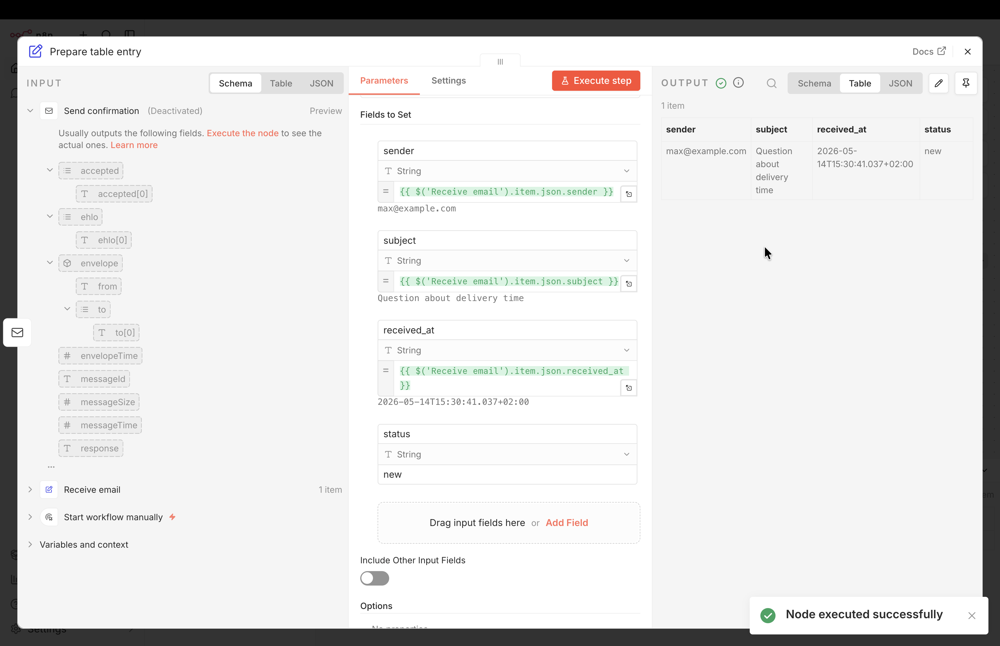
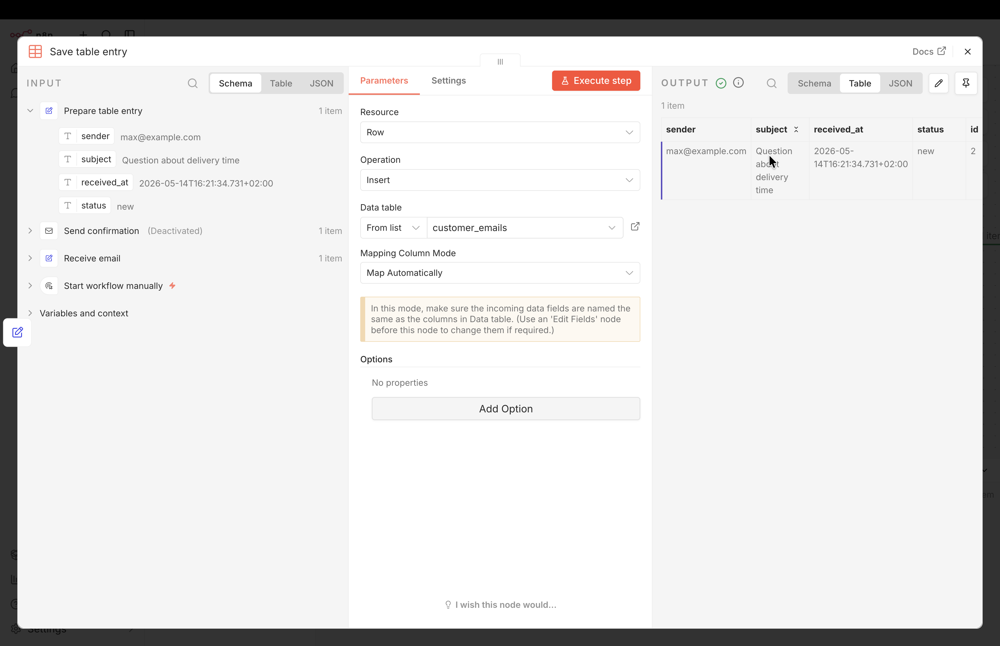
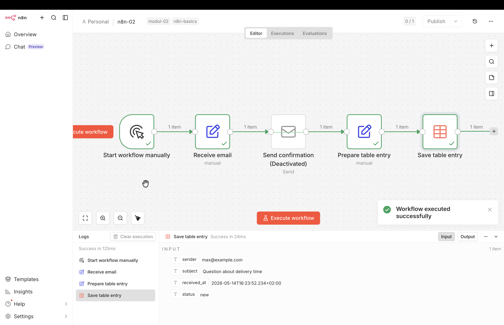
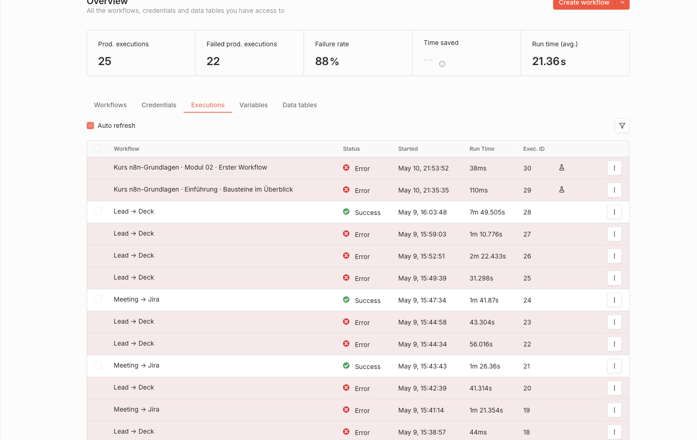

# Der erste Workflow: Mail an sich selbst

In diesem Kapitel bauen wir den ersten vollständigen Workflow. Er simuliert eine eingehende Mail, verschickt eine Bestätigung und schreibt einen Eintrag in eine Tabelle. 

## Zielbild

Der fertige Workflow hat fünf Stationen:

1. **Start workflow manually:** Ein Manual-Trigger-Knoten startet den Workflow per Klick.
2. **Receive email:** Ein Set-Knoten erzeugt die Felder `sender`, `subject`, `text` und `received_at`.
3. **Send confirmation:** Ein Send-Email-Knoten antwortet an den Absender.
4. **Prepare table entry:** Ein zweiter Set-Knoten bringt die Daten in Tabellenform.
5. **Save table entry:** Ein Data-Table-Knoten schreibt eine Zeile in die Tabelle `customer_emails`.

{#fig-m02-workflow-zielbild}


## Schnellstart per Import

Wer den fertigen Workflow zuerst sehen will, statt jeden Knoten selbst anzulegen, kann ihn direkt per URL in die eigene n8n-Instanz importieren:

1. Im Editor einen neuen, leeren Workflow anlegen.
2. Oben rechts auf das Drei-Punkte-Menü klicken.
3. **Import from URL** wählen und folgende Adresse einfügen:

   ```
   https://raw.githubusercontent.com/kirenz/n8n-workflows/main/n8n-basics/modul-02-first-workflow.json
   ```

4. Bestätigen. Der Workflow erscheint im Editor mit allen Knoten und Verbindungen.

Nach dem Import sind Manual Trigger, Set, Send Email und Set vorhanden. Der Data-Table-Knoten fehlt bewusst, weil Tabellen-IDs in jeder n8n-Instanz lokal entstehen. Die Tabelle anlegen und im Data-Table-Knoten neu auswählen, dann ist der Workflow vollständig.


## Schritt für Schritt selbst bauen

Wir bauen den oben gezeigten Workflow von links nach rechts. Jeder Knoten in n8n hat dabei einen Namen, der im Canvas angezeigt wird. Nach dem Einfügen vergibt n8n automatisch einen Default-Namen wie *Edit Fields* oder *Send an Email*. Wir benennen jeden Knoten direkt nach dem Einfügen um. Spätere Knoten können dann über den Namen auf einen früheren Knoten zugreifen.

Im Kurs folgen wir einer einheitlichen Konvention:

- Englische Namen in Verb-Form, die beschreiben, was der Knoten tut. Beispiel: `Receive email`. 
- Zu vermeiden sind Apostrophe (`'`), Anführungszeichen (`"`), geschweifte Klammern (`{ }`) und Backslashes (`\`), weil sie mit der Expression- oder JSON-Syntax kollidieren können.


### Vorbereitung: Neuen Workflow anlegen

1. In n8n anmelden.
2. **Overview**-Ansicht (Haus-Symbol links oben im Menü) auswählen.
3. Oben rechts den Button **Create workflow** (oder das Plus-Symbol links oben) wählen.
3. Im leeren Canvas oben links auf den Workflow-Namen (My workflow) klicken und ihn umbenennen in **n8n-02**.
4. Neben dem Workflow-Namen auf **+ Add tag** klicken und die beide tags `n8n-basics` und `modul-02` erstellen und hinzufügen. Tags helfen später bei der Übersicht, Filterung und Dokumentation der Workflows.

{#fig-m02-canvas-leer}


### Schritt 1: Manuellen Auslöser einfügen

1. Auf das große Plus-Symbol in der Canvas-Mitte klicken.
2. Im rechts erscheinenden Knoten-Picker oben **Trigger manually** wählen.
3. Oberhalb des Knotens auf die 3 Punkte klicken und **Rename** wählen.
4. Den Knoten umbenennen in *Start workflow manually*.

Eine weitere Konfiguration ist nicht nötig.

{#fig-m02-picker-trigger}

### Schritt 2: Receive email

1. Rechts neben dem Knoten *Start workflow manually* erscheint ein Plus. Darauf klicken.
2. Im Suchfeld des Knoten-Pickers *Edit Fields* eingeben.
3. **Edit Fields (Set)** auswählen.
4. Den Knoten oben links umbenennen in *Receive email* (Default-Name: *Edit Fields*).
5. `Mode` bei *Manual Mapping* belassen.
6. Bei `Fields to Set` auf *Add Field* klicken und nacheinander vier Felder eintragen:

| Name | Typ | Value | Modus |
|---|---|---|---|
| `sender` | String | `max@example.com` | Fixed |
| `subject` | String | `Question about delivery time` | Fixed |
| `text` | String | `Hello, I ordered yesterday and was wondering when delivery will arrive. Best regards, Max` | Fixed |
| `received_at` | String | `{{ $now.toISO() }}` | Expression |

Die ersten drei Felder sind feste Werte, die bei jeder Ausführung gleich bleiben. Das vierte Feld `received_at` soll den tatsächlichen Ausführungszeitpunkt liefern, deshalb verwenden wir hier eine Expression.

::: {.callout-note title="Was bedeutet der Ausdruck `$now.toISO()`?" collapse="true"}
Der Ausdruck setzt sich aus drei Bestandteilen zusammen:

- `{{ ... }}` kennzeichnet in n8n einen Ausdruck. Der Inhalt wird als JavaScript ausgewertet, nicht wörtlich übernommen.
- `$now` ist eine eingebaute n8n-Variable. Sie liefert den aktuellen Zeitpunkt.
- `.toISO()` wandelt diesen Zeitpunkt in eine Zeichenkette nach dem [ISO-8601-Standard](https://en.wikipedia.org/wiki/ISO_8601) um.

Eine typische Ausgabe lautet `2026-05-14T10:23:45.123+02:00` und enthält Datum, Uhrzeit mit Millisekunden sowie den Zeitzonen-Offset. Der Wert wird bei jeder Workflow-Ausführung neu berechnet und entspricht damit dem tatsächlichen Ausführungszeitpunkt.

**Verwandte Varianten:**

- `{{ $now.toFormat('dd.MM.yyyy') }}` liefert das Datum im deutschen Format, etwa `14.05.2026`.
- `{{ $today.toISO() }}` liefert den aktuellen Tag.
- `{{ $now.plus({days: 7}).toISO() }}` liefert den Zeitpunkt sieben Tage nach der Ausführung.

Solche Zeit-Ausdrücke lassen sich in jedem Feld eines beliebigen Knotens verwenden, sobald der Expression-Modus aktiv ist. Typische Anwendungsfälle sind Dateinamen mit Zeitstempel, Filterbedingungen auf Basis des aktuellen Datums oder das Setzen eines `createdAt`-Feldes vor dem Schreiben in eine Datenbank.
:::

7. Auf *Execute step* klicken. Im Output-Panel rechts erscheinen die vier Felder.

{#fig-simulierte-mail-set}

::: {.callout-note title="Drei Ansichten im Output-Panel"}
Das Output-Panel bietet drei Ansichten für die Daten, die ein Knoten weitergibt:

| Ansicht | Inhalt |
|---|---|
| Table | tabellarische Darstellung der Felder |
| JSON | vollständige Datenstruktur mit Feldnamen |
| Schema | Liste der vorhandenen Felder ohne Werte |

Die JSON-Ansicht zeigt die exakten Feldnamen, mit denen Expressions in nachfolgenden Knoten arbeiten. Wenn ein Feld `sender` heißt, funktioniert `{{ $json.sender }}`. Liefert ein Trigger stattdessen `fromEmail`, muss die Expression angepasst werden [@n8nDocsCreateRun].

{#fig-output-panel-ansichten}
:::

8. Oben rechts im Menü auf `x` klicken, um die Detailansicht zu verlassen und zum Canvas zurückzukehren.


### Schritt 3: Send confirmation

1. Rechts am Knoten *Receive email* auf `+` klicken.
2. Im Knoten-Picker **Send Email** suchen und auswählen.
3. Den Knoten oben links umbenennen in *Send confirmation* (Default-Name: *Send an Email*).

Mit dem Öffnen des Knotens erscheint die Drei-Spalten-Ansicht des Knoten-Editors: links der Input, in der Mitte die Parameter dieses Knotens, rechts erscheint nach *Execute step* der Output. 

4. Felder konfigurieren (Operation auf `Send` belassen):

| Feld | Wert | Modus |
|---|---|---|
| From Email | `info@company.com` | Fixed |
| To Email | `{{ $json.sender }}` | Expression |
| Subject | `Thank you for your message` | Fixed |

::: {.callout-note title="Was bedeutet `{{ $json.sender }}`?"}
`$json` bezeichnet die Daten, die der vorherige Knoten weitergegeben hat. In der Input-Spalte links sind diese Felder sichtbar: `sender`, `subject`, `text` und `received_at`. `.sender` greift auf das Feld `sender` zu, in unserem Fall `max@example.com`.

Statt die Expression von Hand zu tippen, kann das Feld `sender` auch aus der Input-Spalte per Drag-and-drop in das Parameter-Feld gezogen werden. n8n erzeugt die Expression dann automatisch.
:::

Das Feld `Email Format` steht standardmäßig auf `HTML`. Wir stellen es auf `Text` um, damit Absätze und Zeilenumbrüche im Beispieltext erhalten bleiben.

Beispiel-Text für das Feld `Text`:

```text
Hello,

thank you for your message. We have received it and will get back to you within one business day.

Subject of your inquiry: {{ $json.subject }}

Best regards
The customer service team
```

5. Auf **Execute step** klicken.

An dieser Stelle erscheint die Fehlermeldung *Node does not have any credentials set*, weil die Credentials für den Mail-Versand fehlen. Den Knoten deaktivieren wir gleich, damit der Workflow trotzdem bis zum Ende durchläuft.

{#fig-send-email-knoten}


6. Oben rechts im Menü auf `x` klicken, um die Detailansicht zu verlassen und zum Canvas zurückzukehren.

7. Damit der Workflow trotzdem bis zum Ende durchläuft, stellen wir den Knoten *Send confirmation* über das Drei-Punkte-Menü oberhalb des Knotens auf *Deactivate*.

Die folgenden Schritte 4 und 5 können wir nun testen, ohne dass der deaktivierte Knoten einen Fehler ausgibt. Nach dem Anlegen des Credentials aktivieren wir den Knoten wieder.

### Schritt 4: Prepare table entry

1. Rechts am Knoten *Send confirmation* auf `+` klicken.
2. Im Knoten-Picker **Edit Fields (Set)** suchen und auswählen.
3. Den Knoten umbenennen in *Prepare table entry* (Default-Name: *Edit Fields*).
4. `Mode` bleibt auf *Manual Mapping*.
5. Im Input-Panel links auf *Receive email* klicken. Anschließend die drei Felder `sender`, `subject` und `received_at` nacheinander per Drag-and-drop in den Bereich `Fields to Set` ziehen.
6. Ein viertes Feld manuell über *Add Field* anlegen: Name `status`, Wert `new`, Modus *Fixed*.

Das Ergebnis im Knoten:

| Name | Wert | Modus |
|---|---|---|
| `sender` | `{{ $('Receive email').item.json.sender }}` | Expression |
| `subject` | `{{ $('Receive email').item.json.subject }}` | Expression |
| `received_at` | `{{ $('Receive email').item.json.received_at }}` | Expression |
| `status` | `new` | Fixed |

::: {.callout-note title="Warum eine Cross-Node-Expression?"}
Eine sogenannte Cross-Node-Expression `$('Knotenname').item.json.feld` greift gezielt auf einen früheren Knoten zu. Sie ist hier nötig, weil zwischen *Receive email* und diesem Knoten der *Send-Email-Knoten* liegt. Ein einfaches `$json.sender` würde dessen Output referenzieren, nicht die ursprünglichen Mail-Felder. Durch das Umschalten der Quelle im Input-Panel auf *Receive email* erzeugt n8n die robuste Form automatisch.
:::

7. Auf **Execute step** klicken. Im Output stehen die vier Spalten des späteren Tabelleneintrags.

{#fig-m02-set-eintrag}

8. Oben rechts im Menü auf `x` klicken, um die Detailansicht zu verlassen und zum Canvas zurückzukehren.


### Schritt 5: Data Table anlegen und Eintrag schreiben

Ein "Data Table" speichert strukturierte Daten direkt in n8n. Die Tabelle ist nicht Teil des Workflows, sondern liegt auf der Projekt-Ebene und wird aus dem Workflow heraus über einen Data-Table-Knoten beschrieben oder gelesen.

**Tabelle anlegen:**

Die Verwaltung der Data Tables liegt außerhalb des Workflow-Editors. Wir verlassen den Editor kurz, legen die Tabelle an und kehren danach in den Workflow zurück.

1. Oben links auf **Overview** klicken, um zur Projekt-Übersicht zurückzukehren.
2. In der oberen Menüleiste auf **Data tables** klicken (gleiche Ebene wie *Workflows*, *Credentials* und *Executions*).
3. Auf **Create Data Table** klicken.
4. Nam vergeben: `customer_emails` (`From scratch` auswählen).
5. Oben rechts **Add Column** klicken und nacheinander vier Spalten hinzufügen:

| Name | Type |
|---|---|
| `sender` | string |
| `subject` | string |
| `received_at` | string |
| `status` | string |

n8n ergänzt automatisch eine `id`-Spalte, die jede Zeile eindeutig identifiziert. In der Übersicht erscheint die neue Tabelle daher mit insgesamt fünf Spalten.

**Data-Table-Knoten in den Workflow einfügen:**

1. In der Projektübersicht wieder zu **Workflows** wechseln und n8n-02 auswählen.
2. Rechts am Knoten *Prepare table entry* auf das Plus-Symbol klicken.
3. Im Knoten-Picker **Data table** suchen und auswählen.
4. Im erscheinenden Action-Menü unter *Row Actions* die Action **Insert row** auswählen.
5. Den Knoten links oben umbenennen in *Save table entry* (Default-Name: *Insert row*).
6. Im Parameters-Panel:
    - `Resource`: `Row` belassen (Default).
    - `Operation`: `Insert` belassen (Default).
    - `Data table`: Modus `From list` belassen und im rechten Dropdown `customer_emails` auswählen.
    - `Mapping Column Mode`: auf `Map Automatically` umstellen.
7. Auf **Execute step** klicken.

::: {.callout-note title="Warum `Map Automatically` hier funktioniert"}
`Map Automatically` sucht im eingehenden Datenobjekt nach Feldern, die genauso heißen wie die Spalten der Tabelle, und übernimmt sie eins zu eins. Weil der Knoten *Prepare table entry* die Felder bewusst mit identischen Namen liefert (`sender`, `subject`, `received_at`, `status`), greift das automatische Mapping ohne weitere Konfiguration.

Der manuelle Modus `Map Each Column Manually` wäre nötig, wenn die Feldnamen abweichen, ein Wert umgerechnet werden muss oder eine Spalte fest gesetzt werden soll, ohne aus dem Input zu stammen.
:::

{#fig-m02-datatable-knoten}

8. Oben rechts im Menü auf `x` klicken, um die Detailansicht zu verlassen und zum Canvas zurückzukehren.


### Workflow speichern und vollständig ausführen

1. In der Workflow-Übersicht auf **Execute Workflow** klicken.
2. Alle fünf Knoten bekommen einen grünen Haken (mit Ausnahme des deaktivierten Knotens *Send confirmation*, der übersprungen wird). Es erscheint die Bestätigung *Workflow executed successfully*.
3. Zur Kontrolle die Tabelle `customer_emails` öffnen: oben links auf **Overview** klicken, zur Projekt-Übersicht wechseln und im Tab **Data tables** auf `customer_emails` klicken.
4. In der Tabelle erscheint eine neue Zeile mit Werten für `sender`, `subject`, `received_at` und `status` (Wert `new`) sowie eine automatisch vergebene `id`.

{#fig-m02-workflow-erfolgreich}


## Fehler diagnostizieren

Ein roter Knoten erfordert keinen Neuaufbau des Workflows. Wir lesen die Fehlermeldung, prüfen den Input des Knotens und vergleichen ihn mit der Knoten-Einstellung. Häufige Ursachen sind ein fehlendes Credential, ein abweichender Feldname oder ein Testdatensatz ohne Wert. Den frühesten Fehler im Workflow beheben wir zuerst, denn falsche Daten in Knoten 2 machen einen Blick auf Knoten 4 überflüssig.

Eine erste Orientierung bei wiederkehrenden Symptomen:

| Symptom | Wahrscheinliche Ursache | Nächster Prüfschritt |
|---|---|---|
| Send Email schlägt fehl | SMTP-Credential fehlt oder Absenderadresse passt nicht | Credential öffnen, Testadresse prüfen |
| Empfänger ist leer | `sender` existiert im Input nicht | Output des vorherigen Knotens in JSON prüfen |
| Data Table schreibt nicht | Tabelle oder Spalte fehlt | Tabelle `customer_emails` und Spaltennamen prüfen |
| Zeitstempel fehlt | Expression im Set-Knoten falsch | `{{ $now.toISO() }}` testen |


## Vom Test zum Live-Betrieb

Bisher lief der Workflow nur per Klick auf *Execute Workflow*. Damit er automatisch auf eingehende Mails reagiert, sind drei Anpassungen nötig: ein echter Trigger, gültige Credentials und der Active-Modus.

1. **Trigger austauschen.** Den Knoten *Start workflow manually* entfernen und stattdessen einen Mail-Trigger einfügen, etwa *Email Trigger (IMAP)* oder *Gmail Trigger*.
2. **Credentials hinterlegen.** Für den Trigger ein IMAP- oder OAuth-Credential anlegen, für *Send confirmation* ein SMTP-Credential. Die Credential-Arten sind im Kapitel [Credentials vorbereiten](credentials.qmd) beschrieben.
3. **Send-Email-Knoten reaktivieren.** Den in Schritt 3 deaktivierten Knoten *Send confirmation* über das Drei-Punkte-Menü wieder auf *Activate* setzen.
4. **Workflow aktivieren.** Oben rechts den Schalter *Active* einschalten.
5. **Testlauf prüfen.** Eine Testmail aus einer eigenen Adresse an das Trigger-Postfach senden. Im linken Menü auf **Executions** klicken und den Lauf öffnen. Bestätigungsmail und neue Zeile in der Tabelle `customer_emails` kontrollieren.

{#fig-executions-log}

Sobald der Workflow aktiv ist, behandelt n8n jede eingehende Mail im Trigger-Postfach als produktives Ereignis. Eine produktive Support- oder Sales-Adresse eignet sich daher nicht als erste Trigger-Quelle. Für den ersten Live-Test empfiehlt sich eine separate Testadresse.

::: {.callout-important title="Fallstricke im Live-Betrieb"}
Drei Stolpersteine zeigen sich erfahrungsgemäß beim ersten produktiven Lauf:

- **Trigger feuert nicht.** Der häufigste Grund ist ein abgelaufener OAuth-Token oder ein IMAP-Server, der nach einer Stunde Inaktivität die Verbindung schließt. Unter **Executions** prüfen, ob überhaupt ein Lauf stattfindet; in den Trigger-Einstellungen ggf. das Polling-Intervall auf 1 Minute setzen und das Credential neu autorisieren.
- **Doppelverarbeitung nach n8n-Restart.** Ohne eine Idempotency-Spalte verarbeitet n8n bei einem Neustart die letzten Mails erneut. Für produktive Workflows gehört eine `external_message_id`-Spalte in die Tabelle, die vor jedem Insert geprüft wird (dieses Pattern vertieft der Aufbaukurs *KI-Agenten in n8n*).
- **Bestätigungs-Mail landet im Spam.** SMTP-Mails von neuen Absenderdomains haben anfangs keinen Reputations-Score. Vor dem Live-Schalten einen SPF- und DKIM-Eintrag setzen oder einen Mail-Versand-Dienst wie Postmark oder SendGrid nutzen.
:::

## Kontrollpunkt für Modul 02

Am Ende dieses Moduls sollten folgende Punkte bekannt sein:

- Einen Workflow neu anlegen, umbenennen und mit Tags versehen.
- Knoten einfügen, umbenennen und über das Plus-Symbol verketten.
- Mit dem Set-Knoten (`Edit Fields`) Felder erzeugen, die nachfolgende Knoten weiterverwenden.
- Einfache Expressions schreiben und lesen: `{{ $json.feld }}`, `{{ $now.toISO() }}` sowie Cross-Node-Expressions `{{ $('Knotenname').item.json.feld }}`.
- Eine Data Table auf Projekt-Ebene anlegen und mit dem Data-Table-Knoten per `Map Automatically` Zeilen einfügen.
- Einen Knoten temporär deaktivieren, um den Workflow trotz fehlender Credentials bis zum Ende durchlaufen zu lassen.
- Den Workflow vom Manual-Trigger auf einen Mail-Trigger umstellen und aktivieren.


