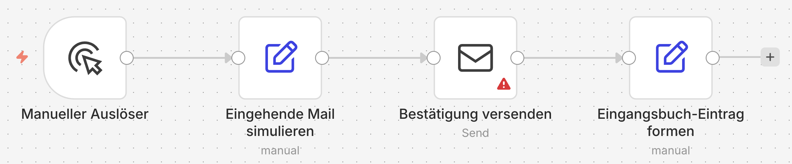

# Einführung {.unnumbered}

Bevor wir in einzelne Funktionen einsteigen, hilft ein gemeinsames Bild davon, wie ein n8n-Workflow aufgebaut ist. Wir nehmen dafür ein konkretes Beispiel und benennen daran die vier Bausteine, die im ganzen Kurs wiederkehren. Alle weiteren Begriffe führen wir später ein, jeweils dort, wo sie zum ersten Mal gebraucht werden.

## Ein Workflow in einem Bild

Stellen wir uns einen kleinen, automatischen Ablauf vor: Über das Kontaktformular einer Website trifft eine Nachricht ein. Daraufhin geht eine Bestätigung an den Absender zurück, und die Nachricht wird in einer Tabelle festgehalten. Niemand stößt diese Schritte von Hand an, sie laufen als zusammenhängende Kette.

{#fig-intro-bausteine}

An diesem Bild lassen sich vier Begriffe ablesen, die den Rest des Kurses tragen:

- Die gesamte Kette von der eingehenden Mail bis zum Tabelleneintrag ist ein **Workflow**.
- Der Auslöser ganz links, hier die eingehende Mail, ist der **Trigger**. Er startet die Kette, zeitgesteuert, app-spezifisch oder manuell zum Testen.
- Jeder einzelne Schritt dazwischen ist eine **Node**. Sie nimmt Daten vom vorigen Schritt entgegen, führt eine Aktion aus und reicht das Ergebnis weiter.
- Ein vollständiger Durchlauf der Kette von Anfang bis Ende ist eine **Execution**. n8n protokolliert pro Execution die Eingangsdaten, die Ergebnisse jeder Node und etwaige Fehler.

Mit diesen vier Begriffen lässt sich jeder Workflow im Kurs lesen.

## Was später dazukommt, wenn wir es brauchen

Die übrigen Bausteine führen wir nicht hier auf Vorrat ein, sondern dort, wo sie zum ersten Mal konkret auftauchen:

- **Credentials** (Zugangsdaten zu externen Systemen) bereiten wir im Kapitel [Credentials vorbereiten](first-workflows/credentials.qmd) vor.
- **Expressions** (kurze Ausdrücke wie `{{ $json.sender }}`, die Daten aus dem vorigen Schritt referenzieren) und die **Data Table** (n8ns eingebaute Tabelle) lernen wir hands-on in [Der erste Workflow](first-workflows/first-workflow.qmd).
- **Integrationen** zu externen Anwendungen und die **KI-Knoten** mit ihren Sprach-Modellen begegnen uns in den folgenden Modulen. Die tiefen Agenten-Konzepte behandelt der Aufbaukurs *KI-Agenten in n8n*.

So bleibt der Einstieg schlank, und jeder Begriff bekommt seinen Kontext.

## Glossar zum Nachschlagen

Wer einen Begriff später nachschlagen möchte, findet hier alle Bausteine kompakt:

| Baustein | Kurz erklärt |
|---|---|
| Workflow | Eine Kette von Schritten, durch ein Ereignis ausgelöst, mit einem bestimmten Zweck. |
| Trigger | Der Auslöser, der den Workflow startet (zeitgesteuert, app-spezifisch oder manuell). |
| Node | Ein einzelner Schritt: nimmt Daten entgegen, führt eine Aktion aus, reicht sie weiter. |
| Sticky Note | Eine erklärende Notiz auf der Arbeitsfläche, ohne Funktion im Datenfluss. |
| Execution | Ein einzelner Lauf des Workflows von Anfang bis Ende, mit Log. |
| Expression | Ein kurzer Ausdruck, der Daten aus einem vorigen Schritt referenziert, z. B. `{{ $json.sender }}`. |
| Credentials | Zugangsdaten zu externen Systemen, getrennt vom Workflow gespeichert. |
| Integration / API | Eine vorbereitete Verbindung zu einer externen App, die im Hintergrund deren API nutzt. |
| Data Table | Die in n8n eingebaute Tabellen-Datenbank für Workflow-Ergebnisse. |
| KI-Knoten / Sprach-Modell | Bausteine für KI im Workflow; das Sprach-Modell (LLM) antwortet in natürlicher Sprache (OpenAI, Anthropic, Google oder lokal über Ollama). |
