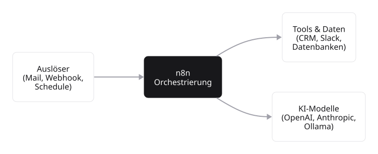

# Was n8n im Kern leistet

Eine sinnvolle Einordnung von n8n setzt voraus, das Funktionsprinzip zu verstehen. Wir beginnen daher mit einem konkreten Anwendungsfall, bevor wir uns Pricing, Hosting und Tool-Vergleichen zuwenden.

## Ein konkreter Anwendungsfall

Über das Kontaktformular einer Website geht eine Nachricht ein. Drei Schritte sollen automatisch ablaufen, ohne dass eine Person den Vorgang manuell anstößt:

1. **Auslöser:** Eine neue Nachricht trifft über das Kontaktformular ein.
2. **Antworten:** Eine Bestätigungs-E-Mail geht zurück: „Vielen Dank, wir melden uns innerhalb eines Werktags."
3. **Festhalten:** Die Nachricht landet in einer Tabelle, damit das Team sie später bearbeiten kann.

Genau für solche immer wiederkehrenden Abläufe ist n8n gebaut, egal ob Kontaktformular, eingehende Rechnung oder wöchentliches Reporting. Drei Schritte, drei Werkzeuge, ein einziger Workflow, der danach von alleine läuft.

## Zwei Kernaufgaben

n8n erfüllt im Kern zwei Aufgaben, die im selben Editor zusammenfallen:

**Daten zwischen Werkzeugen bewegen.** n8n bringt über fünfhundert fertige **Integrationen** mit, also vorbereitete Verbindungen zu externen Anwendungen wie Salesforce, HubSpot, Slack, Microsoft Teams, Notion oder Airtable. Anwendungen mit einer offenen API, also einer dokumentierten Schnittstelle für den automatisierten Zugriff von außen, lassen sich zusätzlich anbinden. Trigger, Schritte und Verbindungen werden im Editor visuell zusammengeklickt, eigener Code ist optional.

**KI-Bausteine als Standard mitbringen.** Ein eigener KI-Assistent im Workflow, eine Suche über firmeninterne Dokumente oder manuelle Freigabe-Schritte für sensible Aktionen, all diese Bausteine sind keine Zusatzkomponenten, sondern Standardausstattung im Editor. Genau diese Mischung aus Daten-Bewegung und KI-Bereitschaft unterscheidet n8n von klassischen Automation-Tools.

::: {.callout-tip title="Werkstatt-Analogie für n8n" collapse="true"}
n8n lässt sich gut mit einer gut sortierten Werkstatt vergleichen:

- **Die Werkstatt** ist die n8n-Instanz selbst, also der Raum, in dem alles zusammenläuft.
- **Werkbänke** sind die einzelnen Workflows, jeder für eine bestimmte Tätigkeit eingerichtet.
- **Werkzeuge an der Wand** sind die Knoten (Mail-Knoten, Tabellen-Knoten, KI-Knoten), die je nach Bedarf von der Werkbank gegriffen werden.
- **Strom und Druckluft** sind die Auslöser im Hintergrund, die die Werkstatt überhaupt erst aktivieren, also ein Trigger pro Werkbank.

Wer eine Werkstatt einrichtet, muss nicht jedes Werkzeug selbst bauen. Er muss aber wissen, welches Werkzeug zu welcher Aufgabe passt.
:::

## Was n8n nicht ist

n8n ist kein vollwertiger Code-Editor, kein Daten-Warehouse und kein eigenständiges KI-Modell. Wer einen mehrstufigen Datentransformations-Job mit komplexer Logik schreibt, ist mit Python, dbt oder Airflow oft besser aufgehoben. Das KI-Modell selbst wird nicht in n8n bereitgestellt, sondern als externer Dienst von OpenAI, Anthropic oder Ollama angebunden. n8n ist die Schicht **dazwischen**, also die Orchestrierung, die alle anderen Werkzeuge zu einem laufenden Prozess verbindet.

{#fig-n8n-orchestrierung width="80%"}

::: {.callout-note}
n8n ersetzt nicht die spezialisierten Werkzeuge, sondern verbindet sie. Wer Salesforce, ein eigenes Sprach-Modell, eine Postgres-Datenbank und ein Slack-Setup hat, nutzt n8n als Bindeglied und nicht als Ersatz.
:::

## Typische Anwendungsfelder

Drei Aufgabenklassen sind typische Einsatzgebiete für n8n:

1. **Routine-Workflows mit Trigger-Aktion-Datenfluss.** Eine Mail trifft ein, eine Aktion wird ausgeführt, ein Eintrag wird geschrieben. Das ist klassisches Tagesgeschäft im Marketing, im Vertrieb und im Customer-Support.
2. **Hybride Pipelines mit deterministischen und KI-Schritten.** Vor- und Nachverarbeitung laufen deterministisch ab, und mittendrin steht ein KI-Schritt für Klassifikation (also das Zuordnen einer Eingabe zu einer Kategorie), Zusammenfassung oder Antwort-Formulierung.
3. **Wissens-Anwendungen mit eigenen Daten.** RAG-Pipelines greifen mit dem Sprach-Modell auf firmeneigene Inhalte zu, statt aus dem allgemeinen Internet-Wissen zu antworten.

Die folgenden Module greifen diese drei Aufgabenklassen jeweils auf und setzen sie Schritt für Schritt mit n8n um.
